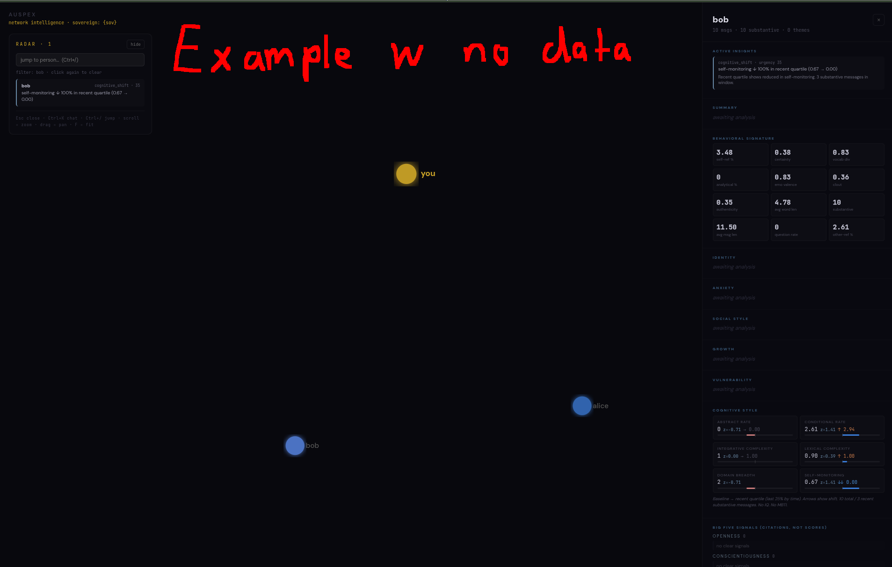

# auspex

> A local chat-archive profiler that turns message exports into an evidence-cited network graph, running entirely on a local Ollama model with `./auspex data/*.txt`.


auspex reads chat exports off disk, builds per-person psychological profiles, and renders them as a force-directed network in the browser. It is a single Rust binary backed by local fastembed embeddings (AllMiniLML6V2) and a local Ollama model for inference. Every claim it surfaces is traced to a specific message id, every confidence number is computed from counted falsification probes rather than typed by the model, and the text never leaves the machine. The graph, the radar feed, and a chat panel are all served by an embedded `std::net` HTTP server bound to `127.0.0.1`, which also proxies `/api/*` to the local Ollama so the UI is same-origin.

The pipeline runs in phases per person: classify messages, extract cited observations, cluster them into themes, emit falsification specs, probe those specs against an embedding index, compute cognitive markers, and synthesize. Markers are z-scored across the people in the corpus, so they report relative position rather than absolute scores. Self-claims like "i'm an INTJ" are routed into a separate reconciliation stream instead of folding into the profile, and a snapshot diff between runs produces a ranked insight feed of what is changing.

<p align="center">
  <br>
  <sub>The built-in demo corpus (three synthetic people, no LLM passes run). Real runs populate themes, cited quotes, pair warmth, and the insight feed.</sub>
</p>

## Quickstart

```bash
git clone https://github.com/lambdaf-org/auspex-v1
cd auspex-v1
ollama pull gpt-oss:20b              # or qwen2.5:7b, llama3.1:8b, aya-expanse:8b
cp -r lexicons.example lexicons      # seed the gitignored word lists
cp config.example.json config.json   # then edit self_name, handles, aliases
# drop chat exports into data/, one message per line:
#   YYYY-MM-DD HH:MM | sender | message
cargo build --release
OLLAMA_MODEL=gpt-oss:20b ./target/release/auspex data/*.txt
```

The pipeline runs, writes `graph.html`, and then starts the server at `http://localhost:8765/`. With no file arguments the binary falls back to a built-in three-person demo corpus. A running Ollama instance on `localhost:11434` is required for any real analysis.

To reopen the UI against an existing `graph.html` without re-running the pipeline, pass `--serve` (alias `-s`). It exits with an error if `graph.html` is not present.

```bash
./target/release/auspex --serve
```

### Configuration

`config.json` holds identity and alias mapping (gitignored, see `config.example.json`); `self_handles` and per-person `aliases` are folded to a canonical name during parsing. The lexicons in `lexicons/` are plain-text word lists, one entry per line, with `#` for comments. The runtime reads three environment variables:

| Variable | Required | Purpose |
| --- | --- | --- |
| `OLLAMA_MODEL` | No (defaults to `llama3.2`) | Model name passed to every Ollama call. |
| `AUSPEX_PORT` | No (defaults to `8765`) | Port for the embedded HTTP server. |
| `AUSPEX_NO_SERVE` | No | If set to any value, the pipeline writes `graph.html` and exits without serving. |

## Features

- **Provenance on every claim**: each observation carries `support_ids`, and quoted phrases are verified by substring match against the cited message before being saved, so hallucinated quotes are dropped rather than shown.
- **Computed confidence**: theme confidence is `(n_support + 1) / (n_support + 3 * n_falsified + 2)`, derived from counts of falsification probes that succeeded. The model never types the number.
- **Separated self-claims**: statements like "i'm an INTJ" or "i have IQ 145" are pulled into a reconciliation stream and tagged `consistent`, `inconsistent`, `unverifiable`, or `not-literal` against behavioral evidence instead of being merged into the trait profile.
- **Cross-person z-scoring**: cognitive markers (abstract rate, conditional rate, lexical complexity, integrative complexity, domain breadth, self-monitoring) are standardized across the people in the corpus, so the tool reports relative position rather than absolute scores. It does not emit IQ or MBTI values.
- **Pairwise network model**: edges come from reply latency, initiation balance, directional tone, topic overlap, and mentions, with a baseline window and a recent-quartile window. Edge thickness encodes intensity, edge color encodes warmth.
- **Ranked insight feed**: a snapshot diff between runs emits typed insights (new themes, confidence jumps, cognitive shifts, relationship cooling or warming, tone shifts, asymmetric investment, alliance forming, new pairs) ordered by a computed urgency score.
- **Local and same-origin**: a pure `std::net` server serves the graph and cached JSON and proxies `/api/*` to local Ollama, bound to `127.0.0.1` with no remote calls and no telemetry.

## How it works

The binary parses `data/*.txt` into messages, resolves aliases against `config.json`, and embeds new messages into an on-disk fastembed index (only messages not already indexed are embedded). For each sender with at least 10 messages it runs the phased pipeline in `pipeline.rs`: Phase 0 classifies messages, Phase 1 extracts cited observations, Phase 2 clusters them into themes, Phase 3 deepens themes and emits falsification specs, Phase 4 probes those specs against the index to produce validated themes with computed confidence, Phase 5 computes markers, Big Five citation panels, and self-claim reconciliation, then synthesizes, and Phase 6 derives predictions.

After all profiles are built, markers are z-scored across people, pair interactions are computed for the corpus, and each profile is diffed against its previous snapshot to emit insights. A corpus fingerprint lets unchanged people short-circuit the whole pipeline and load from cache, so re-runs do only the work that is new. The result is written to `graph.html` and served, alongside the insight feed in `insights/`. The UI renders a D3 network graph, a radar panel of top insights, a per-person sidebar with cited evidence, a per-edge pair breakdown, and a chat panel that queries the proxied Ollama.

## Contributing

See [lambdaf-org/contributing](https://github.com/lambdaf-org/contributing).

## License

No license file is present in the repository, so no license is granted; all rights reserved.